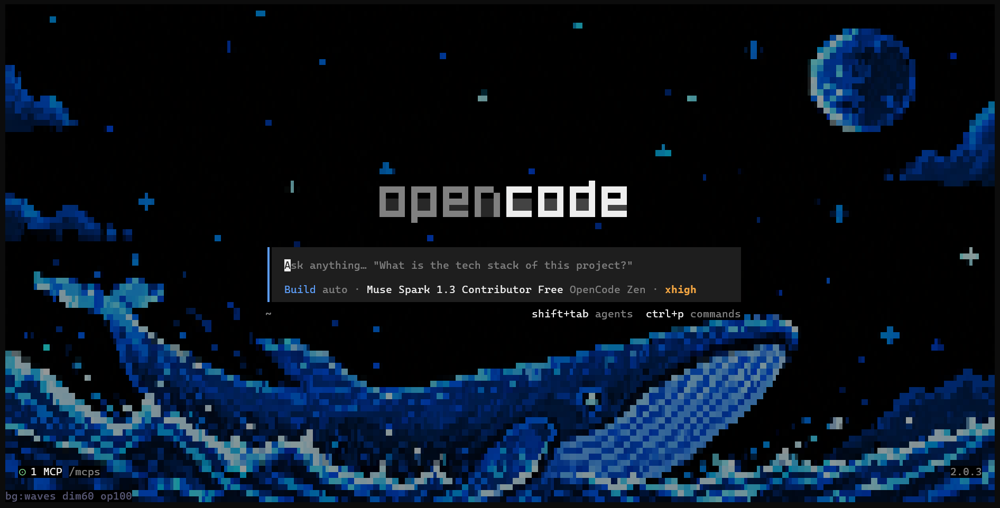

# bee-gee 🐝

A custom pixel-art **wallpaper for the [opencode](https://opencode.ai) home screen** — as a CLI-only TUI plugin. No rebuild of opencode required.



It renders a full-screen image behind the UI (cell-by-cell block art, so it
works in any truecolor terminal — no Kitty/Sixel needed), with procedural art
patterns as fallback, live brightness/opacity sliders, and a bundled
metadata-free wallpaper.

## Requirements

- [opencode](https://opencode.ai) 2.x (`opencode --version`)
- A truecolor terminal (Ghostty, WezTerm, Alacritty, Kitty, Windows Terminal…)
- Node 18+ (for install only)

## Install

Directly from GitHub — no clone needed:

```sh
opencode plugin add parthkhxndelwal/bee-gee
```

Or clone it as a local plugin:

```sh
git clone https://github.com/parthkhxndelwal/bee-gee.git ~/.config/opencode/plugins/bee-gee
```

```jsonc
// ~/.config/opencode/cli.json
{
  "plugins": [{ "package": "./plugins/bee-gee" }],
}
```

Then open `opencode` — you should see the wallpaper behind the home screen
and a `bee-gee loaded` toast.

## Usage

Open the command palette (`Ctrl+P`):

- **Background art: settings** — also matches `settings` / `bg` in the
  filter. Native settings-style dialog: enabled, pattern, wallpaper
  brightness and opacity, reset to `cli.json`. Brightness/opacity open an
  interactive bar: **←/→ adjust in 5% steps with live preview**, enter/esc to
  finish.
- **Background art: toggle** / **Background art: next pattern** — quick
  actions in the same group.

The home footer shows the live state (`bg:grid dim60 op100`).

## Options (`cli.json`)

```jsonc
{
  "plugins": [
    {
      "package": "./plugins/bee-gee",
      "options": {
        "pattern": "waves", // waves | grid | stars | diagonal
        "image": "/absolute/path/to/wallpaper.png", // optional override
        "brightness": 0.6, // 0.05-1 (or 5-100), default 0.6
        "opacity": 1, // 0.05-1 (or 5-100), default 1
      },
    },
  ],
}
```

| Option       | Default           | Notes                                                                                          |
| ------------ | ----------------- | ---------------------------------------------------------------------------------------------- |
| `pattern`    | `waves`           | Procedural art behind/under the wallpaper.                                                     |
| `image`      | bundled wallpaper | Omit to use `assets/opencode-deepseek-theme.png`. Absolute path wins. PNG only for processing. |
| `brightness` | `0.6`             | Pre-dims the image.                                                                            |
| `opacity`    | `1`               | Pre-blends toward the resolved UI background (terminals have no alpha).                        |

Palette/dialog adjustments persist on top of these; **Background art →
Reset to cli.json** (in the settings dialog) hands authority back to the file.

## How it works

- Appends a transparent full-screen layer to the `app` slot, home route only,
  composed **behind** the UI (`zIndex: -1`) — opencode always paints over it,
  so text is never covered.
- `<image protocol="blocks">` rasterizes the wallpaper into terminal cells.
- Brightness/opacity are pre-computed with pure-JS `pngjs` (no native deps)
  and cached per value in the OS temp dir.
- Zero-import server stub (`index.ts`) so the package loads under the
  server's resolver without `node_modules`.

Known platform limits (verified against the opencode 2.0.3 sources): the logo
glyphs carry an opaque shadow color and the prompt textarea has a built-in
fill — neither is reachable from any plugin API, so those two elements keep
their designed backdrops while the wallpaper fills everything else.

## Contributing

Contributions welcome — see [CONTRIBUTING.md](CONTRIBUTING.md).

## License

[MIT](LICENSE)
